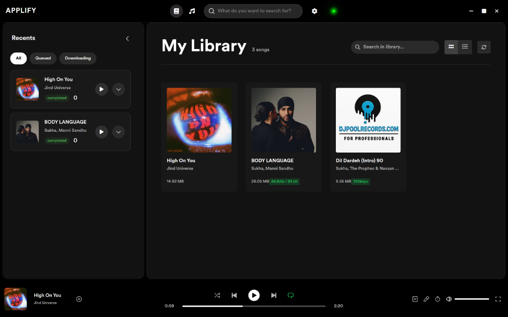
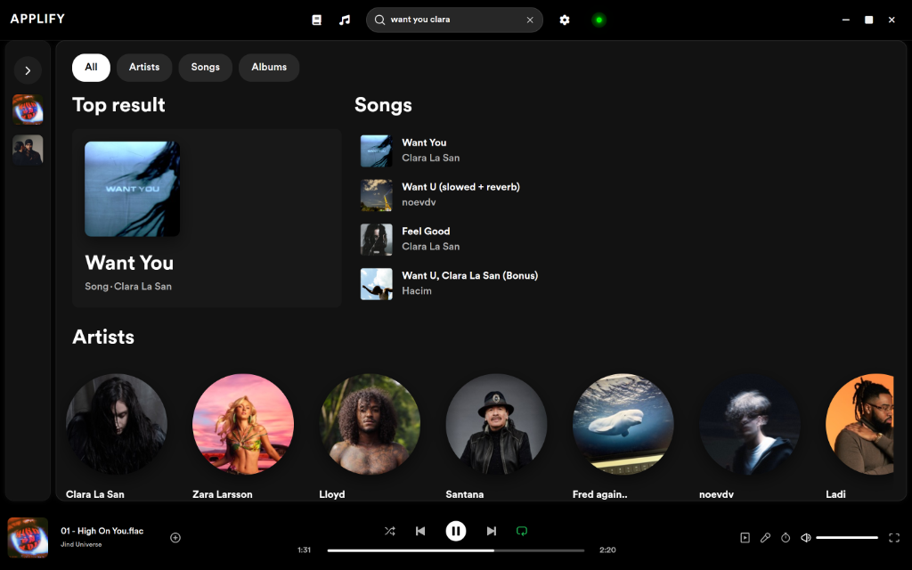
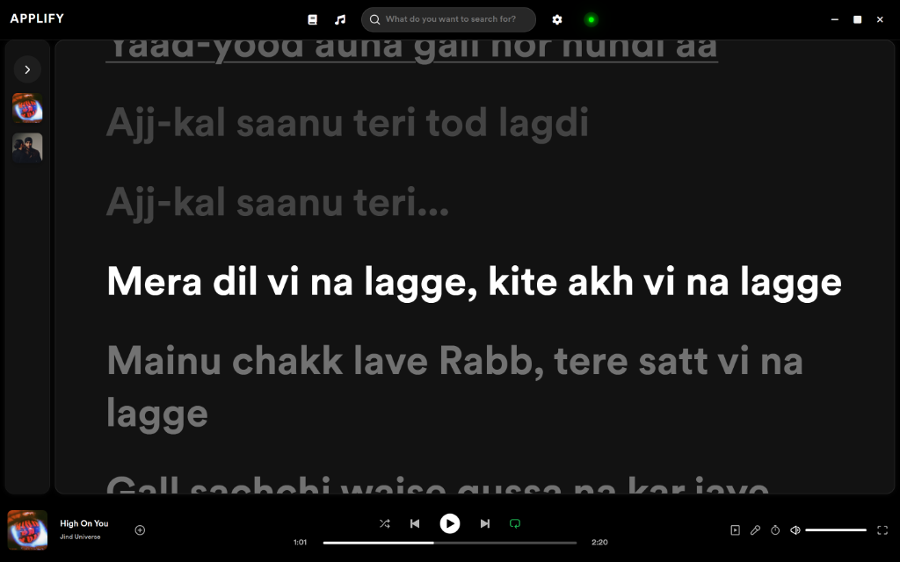

<h1 align="center">🎵 Applify</h1>
<p align="center">
  <em>A desktop client for music discovery, playback exploration, and metadata forensics.</em>
</p>

<div align="center">



</div>

---

# ⚠️ Disclaimer (Personal Use Only)

> [!WARNING]  
> **PERSONAL & EDUCATIONAL USE ONLY**  
> Applify is an open-source, client-side utility designed strictly for personal exploration, educational research, and audio metadata analysis. The developers do not host, index, index, or distribute any content. Users are solely responsible for compliance with copyright laws and regulations in their respective jurisdictions.

---

# 📸 Features & Visual Breakdown

### 1. 📂 Local Music Library & Collection Management

Manage your local collection in a high-fidelity dark-themed interface.

- **Collection Views**: Toggle between detailed list and visual grid layouts.
- **Context Menus**: Right-click to show file in explorer, add to playlists, generate spectrogram visual reports, or delete.
- **Recent Activity Bar**: Sidebar trackers for queued downloads, currently active transfers, and recently played history.

<div align="center">
  
</div>

---

### 2. 🔍 Unified Discovery & Search

Find music metadata and network results instantly.

- **Apple Music Scraper**: Extracts structured albums, artists, songs, and top results from Apple Music's web search using BeautifulSoup.
- **Soulseek Search & Fallback**: Integrates the Nicotine-plus engine to run parallel global searches, parsing attributes like audio bitrates and extension formats.

<div align="center">
  
</div>

---

### 3. 🎤 Synced & Auto-Scrolling Lyrics

Lyrics are parsed and updated in real-time.

- **On-Demand Fetching**: Queries `lrclib.net` dynamically using the track metadata and caches synced lyrics to local database.
- **Dynamic Auto-Scroll**: For synced lyrics, centers the active line. For plain lyrics, scrolls smoothly based on playback progress.
- **Manual Scroll Override**: Temporarily halts auto-scrolling for 5 seconds if manual scrolling is detected to allow reading ahead/behind.

<div align="center">
  
</div>

---

### 4. 🔬 Lossless Audio Forensics

Verify the quality of your audio files.

- **Spectrum Analyzer**: Analyzes WAV and FLAC files to check if they are "fake lossless" (i.e. low-quality MP3s upscaled to FLAC).
- **Spectrogram Report**: Generates and opens a high-fidelity visual analysis displaying linear spectrograms, peak spectral power distribution, high-frequency waveforms correlation, and phase coherence.

<div align="center">
  
</div>

---

# 📦 Packaging & Sharing with Others

### Can this application be shared with others?

**Yes!** Since Applify is built using **Electron** and **PyInstaller**, you can package the entire application into a single standalone installer/executable.
Other users do not need to install Node.js, Python, or pip dependencies. They can simply run the installer on their machine.

### Packaging Commands

To package the application for distribution, run the build script corresponding to the target platform from the root directory:

```bash
# Package for Windows (.exe installer)
npm run build:win

# Package for macOS (.dmg / app package)
npm run build:mac

# Package for Linux (.AppImage / .deb package)
npm run build:linux
```

This script will:

1. Compile the Python backend into a standalone executable (in `backend/dist`).
2. Build the React frontend production assets.
3. Bundle everything into an installer using `electron-builder`.
4. Output the shareable installers inside the `/dist` directory.

---

# Technical Stack

- **Frontend**: TypeScript, React 19, Electron, CSS Modules
- **Backend**: Python 3.10, FastAPI, Uvicorn, TinyDB (using file locks for thread safety)
- **Audio Engines**: PyNicotine core, Mutagen, NumPy, SciPy (Spectral analysis)
- **Lyrics Service**: LrcLib API integration

---

# Installation (For Developers)

### Prerequisites

- **Node.js** (v18+)
- **Python** (v3.10)

### Setup Steps

1. **Clone the repository:**

   ```bash
   git clone https://github.com/Seplestr/Applify.git
   cd Applify
   ```

2. **Install Node.js dependencies:**

   ```bash
   npm install
   ```

3. **Set up the Python backend:**

   ```bash
   python -m venv backend/venv
   # Windows
   backend\venv\Scripts\activate
   pip install -r backend/requirements.txt
   ```

4. **Run in development mode:**
   Open two separate terminal windows from the root directory and run `npm run dev` in both:

   ```bash
   # Terminal 1 starts Python Backend
   npm run dev

   # Terminal 2 starts Electron UI
   npm run dev
   ```

---

<p align="center">
  Made with ❤️ by duru
</p>
