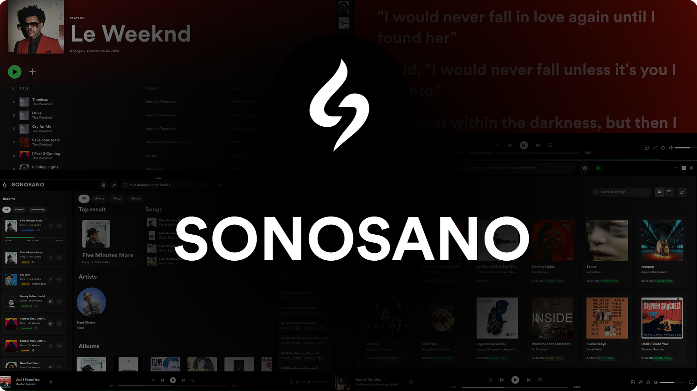
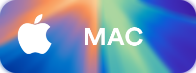
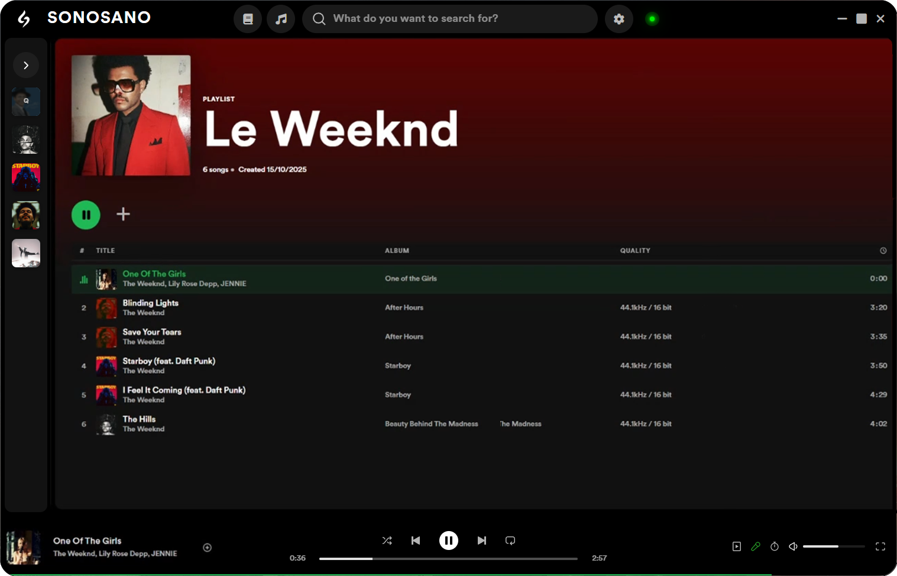
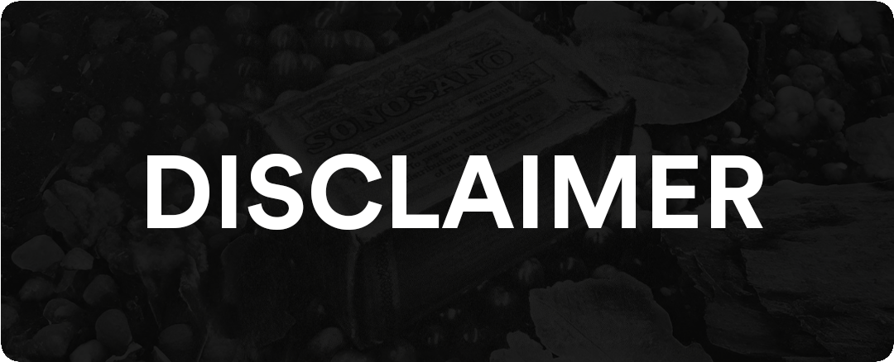

<div align="center">
  
</div>
<p align="center">
  
  <a href="https://discord.gg/Np7YYEVPhR"></a>
</p>

<h3 align="center"><b>Preserve, Archive, share, analyse and enjoy high quality music</b></h3>

# Download

<div align="center">
<table>
  <tr>
    <td align="center"><a href="https://github.com/DIOR/Applify/releases/latest/download/Applify-setup.exe"></a></td>
    <td align="center"><a href="https://github.com/DIOR/Applify/releases/latest/download/Applify.dmg"></a></td>
    <td align="center"><a href="https://github.com/DIOR/Applify/releases/latest/download/Applify_amd64.deb"></a></td>
  </tr>
</table>
</div>

# Build From Source

<details>
  <summary>But I hate Electron</summary>

### Running without Electron (Web UI)

1. **Run the backend:**

   ```bash
   python backend/src/main.py or run the backend exec
   ```

2. Open your browser and go to [applify.dior.com](http://applify.dior.com), I have tested on four browsers - Edge, Chrome support it and Safari, Brave don't
3. Enjoy, and please don't spam about framework
</details>

#### Prerequisites

- [Node.js](https://nodejs.org/) (v18+ recommended) and npm
- [Python](https://www.python.org/downloads/) (v3.9+ recommended) and pip

#### Installation & Running

1.  **Clone the repository:**

    ```bash
    git clone https://github.com/DIOR/Applify.git
    cd Applify
    ```

2.  **Install frontend dependencies:**

    ```bash
    npm install
    ```

3.  **Set up the Python backend:**

    ```bash
    # Create and activate a virtual environment (recommended)
    python -m venv backend/venv

    # On macOS/Linux:
    source backend/venv/bin/activate

    # On Windows:
    backend\venv\Scripts\activate

    # Install backend dependencies
    pip install -r backend/requirements.txt
    ```

4.  **Run the backend:**

    ```bash
    python backend/src/main.py
    ```

5.  **Run the frontend:**
    ```bash
    npm run dev
    ```

# Features

<div align="center">
<table cellpadding="15">
  <tr><td align="center"></td></tr>
  <tr><td align="center"></td></tr>
  <tr><td align="center"></td></tr>
  <tr><td align="center"></td></tr>
  <tr><td align="center"></td></tr>
</table>
</div>

# Contributing

### Read this before contributing

- **Backend-First Approach:** All the core logic, tasks go in python backend, electron is just for UI and nothing else.

- **Safety:** Do not mention or hardcode references to specific commercial music services in the code, UI text, or documentation except the ones I did (I'll remove it later anyways). The application should remain a generic music discovery and management tool.

- **UI & UX Consistency:** This is a very familiar UI, so you already know where to take the designs from.

- **Code Quality:** Follow the existing coding style and conventions. Use TypeScript for the frontend and Python type hints for the backend to maintain code quality and clarity. Add comments for any complex logic.

<div align="center">
  
</div>
<p align="center">
  Let's Dive Deep.
</p>

---

### `I.` — The Nature of the Tool

> It is important to note—this application is not a content service providing you with files, but a **tool**—a simple client for accessing peer-to-peer networks.

> It is not a curated library filled by us—but a **gateway** to a vast, user-driven ecosystem filled by others.

> I do not host, provide, or endorse any of the content you may find—this is not a repository holding data, but merely a **conduit**—connecting you to it.

---

### `II.` — The Burden of the User

> As a result—the responsibility for your actions does not lie with the developers, but rests solely and entirely upon **YOU**—and you alone.

> This application is not a shield from copyright law—but a powerful instrument that demands _your_ own strict legal compliance within _your_ jurisdiction.

> I am not the arbiters of your downloads—but you are the final and only judge of your own conduct. Every search, every download, every share—is not our decision, but yours.

---

### `III.` — The Inevitable Conclusion

> In the event of any consequence—legal or otherwise—liability is not a shared concept that I partake in, but a personal burden you accept in full by using this software.

> In conclusion—this is not an invitation to act without thought, but an explicit **demand** that you act with full awareness of your own responsibilities.

---

<p align="center">
  <em>— Proceed Accordingly. —</em>
</p>
