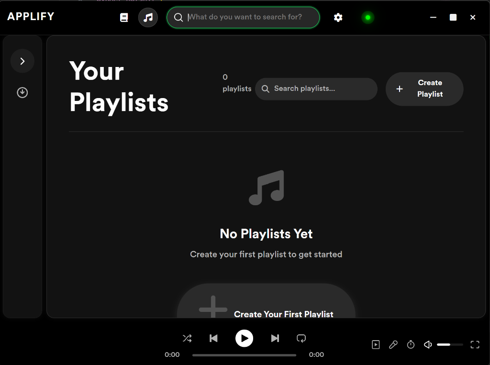
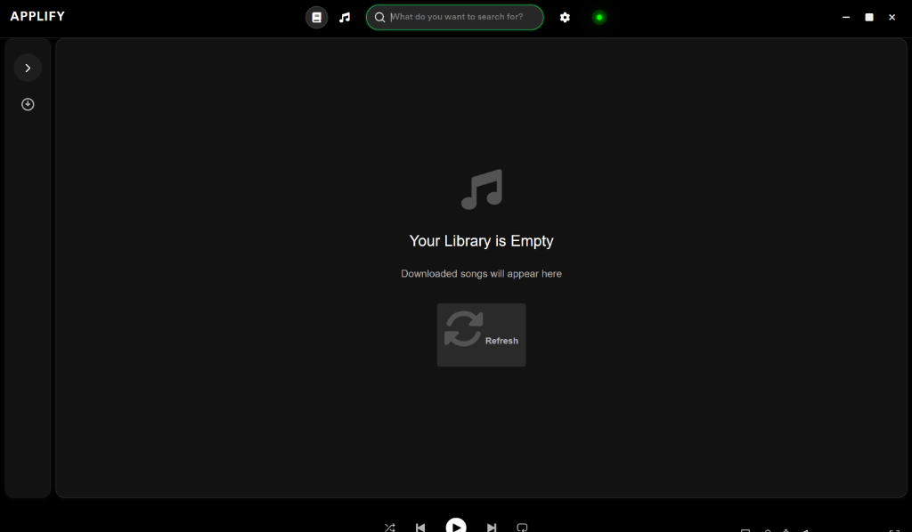
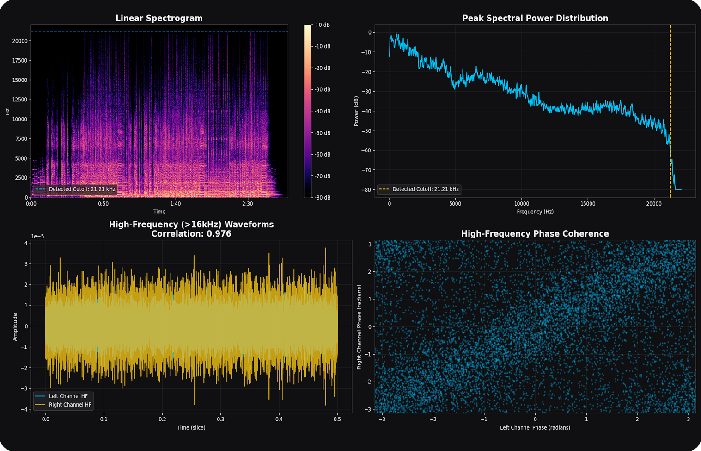

<h1 align="center">🎵 Applify</h1>
<p align="center">
  <em>A desktop-based music exploration, discovery, and metadata analysis client.</em>
</p>

<div align="center">



</div>

---

# What is Applify?

Applify is a sophisticated **desktop client** designed for music discovery, library exploration, and metadata analysis. It integrates web scraping, peer-to-peer exploration, automated metadata taggers, and an audio forensics analyzer into a single React-Electron application.

> [!WARNING]  
> **DISCLAIMER: Personal and Educational Use Only**  
> Applify is strictly intended for personal, educational, and metadata analysis purposes. The developers do not host, index, or distribute any music files. All peer-to-peer activities are performed directly by the client on user-driven queries. Users bear full responsibility for complying with local copyright laws and regulations in their jurisdiction.

---

# 📸 Gallery

<div align="center">
  <h3>Music Discovery & Search</h3>
  
  <br/><br/>
  <h3>Detailed File Metadata Review</h3>
  
  <br/><br/>
  <h3>Lossless Spectral Analysis (Audio Forensics)</h3>
  
</div>

---

# How It Works & Detailed Features

Applify functions as a unified gateway connecting local music management tools with decentralized networks. Here is how its core services operate:

### 1. 🔍 Dual Search & Discovery System

- **Apple Music Scraper**: Queries Apple Music web search. The Python backend scrapes and extracts search response JSON structures (handling serialized server data), returning categorizations for Top Results, Songs, Artists, and Albums.
- **P2P Search (Soulseek Integration)**: Uses a custom thread-safe integration of the Nicotine-plus core engine. It performs parallel distributed search queries, returns file results with quality (bitrate/format) tags, and monitors file transfer updates.

### 2. 📁 Asynchronous File Download Manager

- Uses a reentrant locking architecture (`soulseek_manager.lock`) to manage concurrent socket connections with the Nicotine engine.
- Supports active downloads queue reporting, download cancellation, and resume commands running on a FastAPI background threadpool.

### 3. 🎼 Automated Metadata Tagger

- **Mutagen Tag Extractor**: Extracts audio metadata fields directly from `.mp3`, `.wav`, `.flac`, and other file formats.
- **MusicBrainz Fallback Tagger**: If local tags are incomplete, queries the MusicBrainz API to automatically identify the artist, track title, and album names.

### 4. 🔬 Lossless Audio Forensics

- **Transcode/Upscale Detection**: Spectral analyzer script reviews lossless `.wav` and `.flac` files to identify if they are "fake lossless" (low-quality MP3s upscaled to FLAC).
- Generates high-fidelity visual reports displaying spectrograms and frequency thresholds to verify audio fidelity.

### 5. 🎤 Synced Lyrics Engine (with Auto-Scroll)

- **On-Demand Fetching**: Automatically fetches synced lyrics (`.lrc` format) from `lrclib.net` matching artist/song metadata on the fly if not cached locally.
- **Auto-Scrolling Lyrics**: Auto-scrolls line highlights to follow the song's current time. For plain text lyrics, it calculates playback progress percentage and scrolls smoothly. If manual scrolling is detected, it pauses auto-scroll for 5 seconds to prevent rendering conflicts.

---

# Tech Stack

<div align="center">

| Layer         | Technology                                  |
| ------------- | ------------------------------------------- |
| **Frontend**  | TypeScript, React 19, Electron, CSS Modules |
| **Backend**   | Python 3.10, FastAPI, Uvicorn, TinyDB       |
| **P2P Core**  | PyNicotine core library                     |
| **Metadata**  | Mutagen, MusicBrainz API                    |
| **Lyrics**    | LrcLib API integration                      |
| **Forensics** | NumPy, SciPy (Spectral density analysis)    |

</div>

---

# Getting Started

### Prerequisites

- **Node.js** (v18+)
- **Python** (v3.10)

### Installation Steps

1. **Clone the repository:**

   ```bash
   git clone https://github.com/Seplestr/Applify.git
   cd Applify
   ```

2. **Install Node.js dependencies:**

   ```bash
   npm install
   ```

3. **Set up the Python backend:**

   ```bash
   # Create a virtual environment
   python -m venv backend/venv

   # Activate the virtual environment (Windows)
   backend\venv\Scripts\activate

   # Install dependencies
   pip install -r backend/requirements.txt
   ```

### Running the Application

Start the backend and frontend services by running `npm run dev` in two separate terminals:

```bash
# Terminal 1: Starts Python Backend and Dev Servers
npm run dev

# Terminal 2: Connects and launches the Electron desktop UI
npm run dev
```

---

<p align="center">
  Made with ❤️ by duru
</p>
